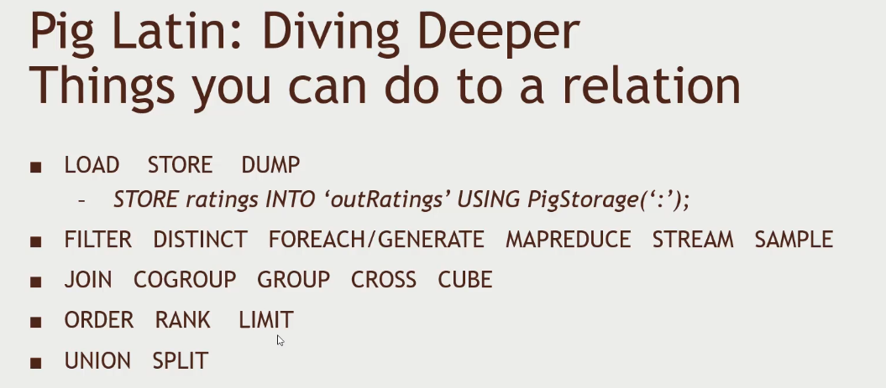

# Pig

> For more information look into the book [Programming Pig: Dataflow Scripting with Hadoop](https://www.amazon.com/Programming-Pig-Dataflow-Scripting-Hadoop/dp/1491937092/ref=pd_sbs_1/132-8475213-1692361?pd_rd_w=5Cake&pf_rd_p=3676f086-9496-4fd7-8490-77cf7f43f846&pf_rd_r=G34CHAB3ZVSRMKD1FPJ7&pd_rd_r=7aafbcc0-3d3c-4054-a0af-4e7384aeebce&pd_rd_wg=xKKVp&pd_rd_i=1491937092&psc=1)

## Commands in Pig

- `CROSS` - takes two tables and calculates the cartesian product.
- `CUBE` - takes more than 2 tables and calculates the cartesian product.
- `RANK` - is just like `ORDER` but assigns an additional column with the rank index.

## Diagnostics

- `DESCRIBE` -  shows the schema of the relationship inside pig. ex. what are the types of the columns
- `EXPLAIN` - insight will show how the query is translated to MapReduce
- `ILLUSTRATE` - will take piece of the mapreduce and shows an example of the execution

## UDFs - User Defined Functions

- `REGISTER`
- `DEFINE`
- `IMPORT`

## Some other functions and loaders

`AVG` `CONCAT` `COUNT` `MAX` `MIN` `SIZE` `SUM`

## Storage and Loaders in other formats

PigStorage - delimiter based data
TextLoader - one line per row
JsonLoader
AvroStorage
ParquetLoader
OrcStorage
HBaseStorage
