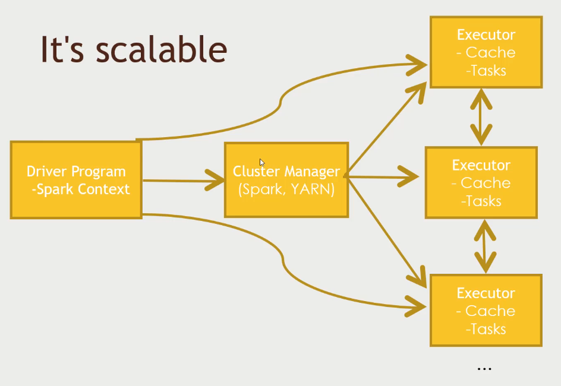
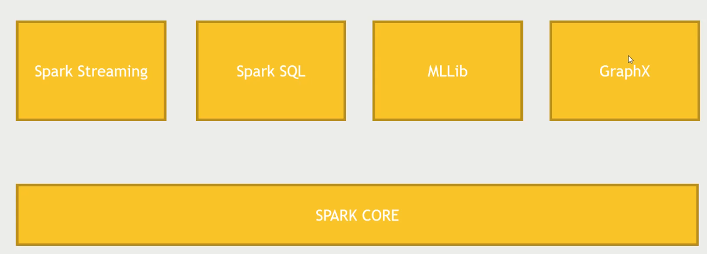
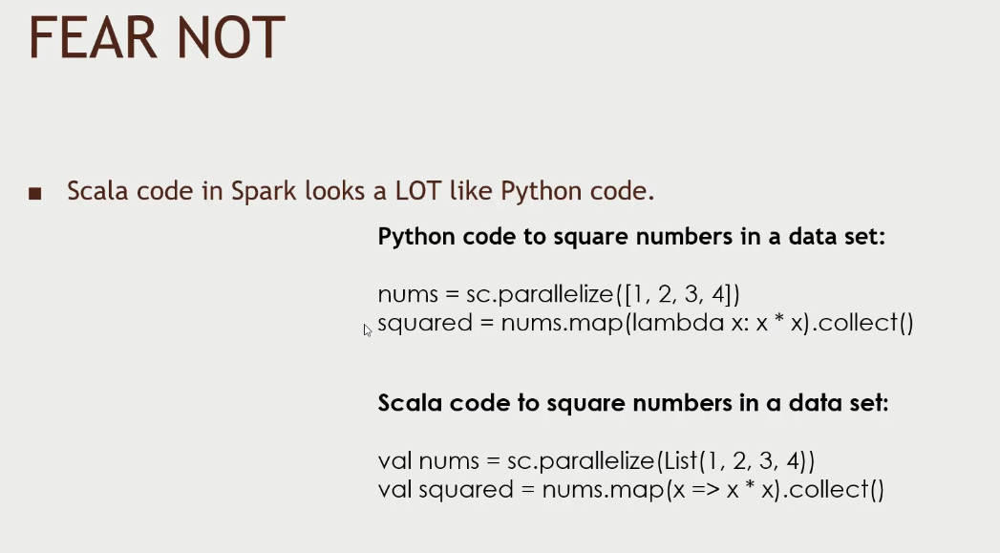
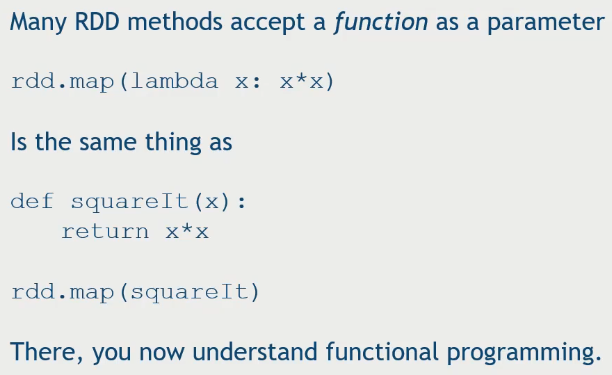

# Spark

- A fast and general engine for large scale data-processing.
- Spark can run on hadoop but it can run without it too. It can run on `YARN` or other cluster manager like `MESOS`.
- Unlike MapReduce which hits the HDFS, Spark is a memory based solution which tries to execute parallel while keeping the data in the cache. This is the reason for its speed and the other reason is because of the directed acyclic graph (DAG engine) which optimizes the workflows. Just like how we can use `Pig` with `Tez`.



## Its not that hard

- Code in python, java, scala
- Built around one main concept: `the Resilient Distributed Dataset (RDD)`
- In Spark 2.0 which came in 2016, they have build functionality to execute on top of RDD which are called `Dataset`. Its a more SQL based take on RDD.

## Components of spark

- We can build on spark core with RDD or there are other tools build on top of spark which we can leverage.
- With Spark Streaming, we can input data in real time like ingesting logs on real time as its being produced and analyze the data in a window of time and produce the results. 
- Spark SQL is a SQL interface to spark where we can use sql like function to use on the dataset. **The future of Spark because most of the effort is focused on this nowadays**
- MLLib - an entire library of machine learning and data mining tools we can run on a dataset. How to breakdown a clustering or regression into mappers or reducers ? we dont need to we can use the MLLib library for it.
- GraphX - analyze graphs where who is connected to who.
- The course uses Python to execute Spark jobs, but spark itself is written in Scala hence it will be much faster with Scala.
- Scala is function programming which compiles to java byte code and with less boiler code than java.



- Both the scala and python code looks the same,




## RDD

- RDD refers to the Resilient Distributed Dataset
- It makes sure that the job is distributed in an evenly manner across cluster and handle failures. In short, RDD are the way to store key and value pairs or any information in an object which can automatically do the right thing on a cluster. Its a data structure which resilient and distributed
- The `SparkContext` is responsible for making RDD's resilient and distributed. The `SparkContext` creates the RDD. The spark shell creates `sc` object for you.
- creating a RDD is simple, ex. calling `nums = parallelize([1, 2, 3, 4])` will create a RDD with 1,2,3,4.
- We can also create an RDD from text file from hdd/hdfs/s3,

```sh
sc.textFile("file://c:/users/frank/gobs=o=text.txt")
	# or s3n:// , hdfs://

# this create RDD from hive
hiveCtx = HiveContext(sc) 
rows = hiveCtx.sql("SELECT name, age FROM users")

# Can also create from JDBC, Cassandra, HBase, Elastisearch, JSON, sequence files, various compressed formats
```

## Tranforming RDDs

- When the RDD is loaded we can use it to perform multiple operations on it

```sh
map
flatmap
filter
distinct
sample
union, intersection, subtract, cartesian

# map example
# take the RDD and square them
rdd = sc.parallelize([1, 2 ,3 , 4])

# This is an example of Python functional programming
squaredRDD = rdd.map(lambda x: x*x)

# This yields 1, 4, 9, 16
```

Functional programming is nothing more than passing a `function` to do some manipulation like to a mapper.



```sh
# RDD actions (to reduce and crunch the numbers down)
collect
count
countByValue - how many times a value occur
take
top
reduce - allows you to pass a reducer function
... and more ...
```

## Example: Lowest Rated Movie using Average Rating

> The script [LowestRatedMovieSpark.py](./LowestRatedMovieSpark.py) - A counting based reduce problem.

- This uses the lower level spark 01 way of doing things using `RDD interface` and then we will move on to the higher level.
- The `SparkConf` contains the information about a spark job like how much memory is allocated and more.
- Go to ambari and change the `log4j` log level to `ERROR` so you wont see unnecessary logs when executing spark jobs.

When running the spark python script we need to run it using the `spark-submit` instead of python because we need to make sure it runs in the cluster than in the local machine. `spark-submit` makes sure that it create the necessary env beforehand.

```sh
> spark-submit LowestRatedMovieSpark.py
```

## Spark 2.0

### DataFrames

- This version of spark we use things called DataFrames and Datasets. RDD are just rows it doesnt know the types, but DataFrames extends RDD.
- DataFrames contains rows of objects, where each row contains structured data.

```txt
from pyspark.sql import SQLContext, Row
hiveContext = HiveContext(sc)
inputData = spark.read.json(dataFile)
inputData.createOrReplaceTempView("myStructuredStuff")
myResultDataFrame = hiveContext.sql("""SELECT foo FROM bar ORDER BY foobar""")

# Other stuff you can do with dataframes
myResultDataFrame.show()
myResultDataFrame.select("someFieldName")
myResultDataFrame.filter(myResultDataFrame("someFieldName" > 200))
myResultDataFrame.groupBy(myResultDataFrame("someFieldName")).mean()
myResultDataFrame.rdd().map(mapperFunction)
```

### DataSets

- DataFrames is really a DataSets of row objects.
- Its a common denomitor between the SparkSQL, MLLib and GraphX
- There is not much difference in python but when working with other language like scala with spark we will see the differences.

### Shell access

Spark SQL exposes a `JDBC`/`OCBC` server (if you built Spark with Hive support)

```txt
# Start it with sbin/start-thriftserver.sh
# Listens on port 10000 by default
# Connect using bin/beeline -u jdbc:hive2://localhost:10000
# Viola, you have a SQL shell to Spark SQL
# You can create new tables, or query existing ones that were cached using hiveCtx.cacheTable("tableName");
```

### User-defined functions (UDF's)

```sh
from pyspark.sql.types import IntegerType
hiveCtx.registerFunction("square", lambda x: x*x, IntegerType())
df = hiveCtx.sql("SELECT square('someNumericFiled') FROM tableName")
```

## SparkSession

> See this for [Spark 2 implementation of LowestRated](./FilteredLowestRatedMovieDateFrame.py)

- Is the new way of running SparkSQL, we dont need to create a context but instead a session which will throughout the entire time.
- `getOrCreate()` creates a session or gets the already existing session.

```sh
> export SPARK_MAJOR_VERSION=2
> spark-submit FilteredLowestRatedMovieDateFrame.py
```

## Movie Recommendation with MLLib

> The complete script is available [here](./MovieRecommendationsALS.py)

- There are two types of filtering, `collaborative filtering` and `content-based filtering`.
  - `content-based` - if A read B, B is similar to C, so recommend `C`. Comparing products.
  - `collaborative` - if A likes something B likes, since A likes `X` product B might like it. Comparing persons.
  - For more on recommendation engine look at this post by [Google](https://developers.google.com/machine-learning/recommendation/collaborative/basics)
- `ALS` is a recommendation algorithm built on top of spark core.
- `lit` is used to put a constant value in the row
- Given the previous rating based on genre identify the ratings for every other movie.
- Add this to `u.data` file on top for example recommendation.

```txt
// u.data
0 50 5 881250949
0 172 5 881250949
0 133 1 881250949
...
```

```sh
> export SPARK_MAJOR_VERSION=2
> spark-submit MovieRecommendationsALS.py
```

## FilteredLowestRated

- We need to get the lowest rated if the movie was rated by more than 10 people.
- Dataframe we can use the `filter("count > 10")` filter function, with RDDs when working with only spark 1 core we can pass a lambda function.
