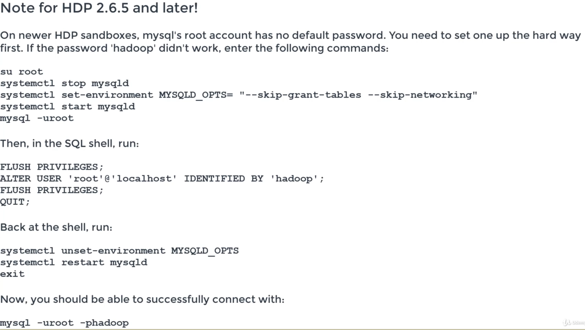
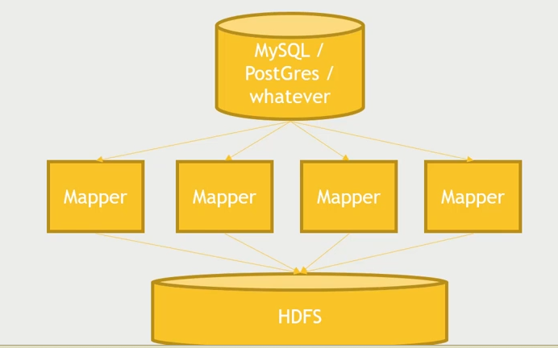

# Hive

- We can create a view to break down a SQL query but its not a materialized view like in database where it stores the copy of the data while this is just a logical view it doesn't store the data anywhere.
- Hive also exposes a `Thrift` service - this lets you talks to the hive server through a web sites/ clients but its not suitable for OLTP where there are so many requests.
- We can also manage Hive through Oozie which lets you schedule jobs and manage it.

## Why Hive ?

- Uses familiar SQL syntax (HiveQL)
- Interactive
- Scalable - works with "big data" on a cluster
- Really most appropriate for data warehouse applications
- Easy `OLAP` queries - WAY easier than writing MapReduce in Java
- Highly optimized
- Highly extensible
  - User defined functions
  - Thrift server - can access from other services
  - JDBC/ODSBC server

## Why not Hive?

- High latency - not appropriate for `OLTP` (Online Transaction Processing) - So we cant use it for high throughput and low latency since all queries are translated to map reduce jobs.
- Stores data de-normalized
- SQL is limited in what it can do
  - Pig, Spark allows more complex stuff
- No transactions
- No record-level updates, inserts, deletes because under the hood there is no real database but flat files but smoke screen to show like RDBMS.

## Integrating MySQL with Hadoop

`sqoop` kicks off a mapreduce job to ingest data from mysql to HDFS. Kafka is another tool for distributing data to a cluster.

```sh
> mysql -u root -p
```






```sh
# Sqoop kicks off MapReduce jobs to handle importing or exporting your data
# Remember: we need to make sure that we have the correct permission for sqoop

# Sqoop: import data from MySQL to HDFS
# movielens is the database name and the table name
sqoop import --connect jdbc:mysql://localhost/movielens --driver com.mysql.jdbc.Driver --table movies

-m 1 (Mean using 1 mapper to use)

# Sqoop: import data from MySQL to Hive
# if we need to skip the intermediate step of dumping the data to hdfs and directly send to hive 
sqoop import --connect jdbc:mysql://localhost/movielens --driver com.mysql.jdbc.Driver --table movies --hive-import

# Sqoop can do incremental imports
# You can keep your relational database and Hadoop in sync
--check-column and --last-value

# Export data from Hive to MySQL
sqoop export --connect jdbc:mysql://localhost/movielens -m 1 --driver com.mysql.jdbc.Driver --table exported_movies --export

# Export data from Hive to MySQL by Specifying the Folder
# export dir will take the table schema from it.
sqoop export --connect jdbc:mysql://localhost/movielens -m 1 --driver com.mysql.jdbc.Driver --table exported_movies --export-dir /apps/hive/warehouse/movies --input-fields-terminated-by '/0001'
```
