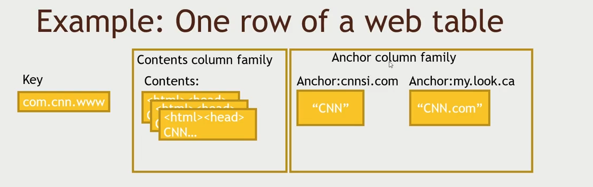
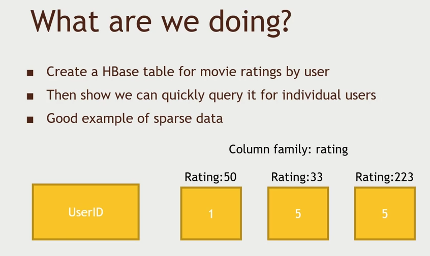
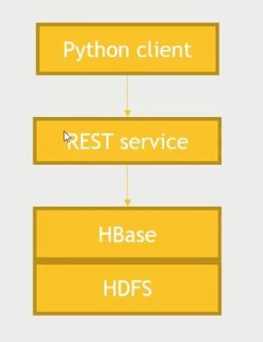
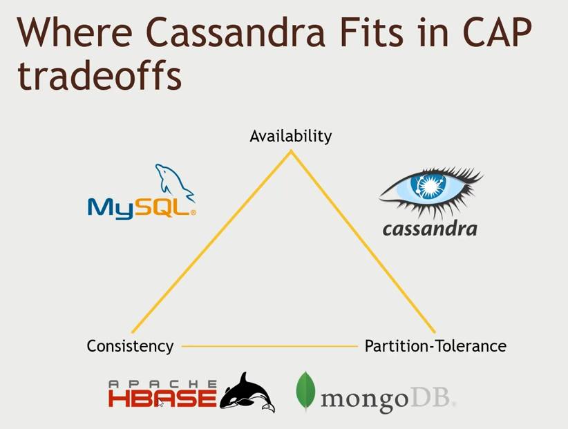
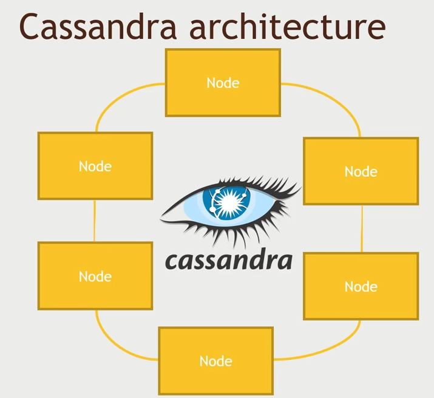
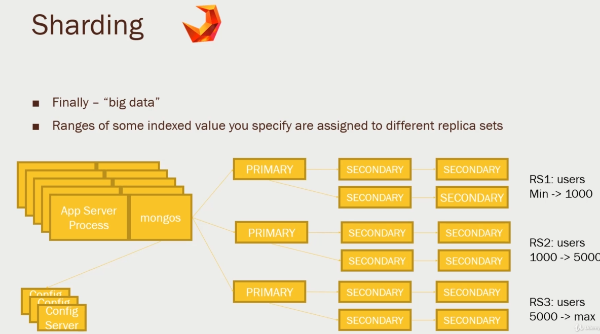

# NoSQL

Doing analytics in RDBMS is great but if we need to really quickly search on millions of dataset like what google has then we need to use NoSQL since RDBMS will not cut it out. Like what the user searched previously, what they buy previously and etc...

- HBase - built on top of HDFS.
- Cassandra
- MongoDB

## Before NoSQL

Before NoSQL in Amazon to scale up a MySQL database we needed to take extreme measures,

- Denormalization (Split up your tables into a lot of tables to query a particular set of data, and it can look very ugly)

- Caching Layers (Using memCachedD distributed in memory to prevent queries from even reaching the database for a lot of traffic, but cache could run into issues like not being synchronized with database)

- Master/Slave setups (Multiple databases that handles reads and writes and the rest gets replicated to handles reads or writes but it requires a Database administrator)

- Sharding (Split database into different ranges where it handles a range of keys, but setting it and adding new shards is a very painful process)

- Materialized Views (Show views in the format that your services expects)

- Removing stored procedures (Removing computing stuff that is actually part of a process of processing a query is an expensive thing to do, so you have to give that up)

## RDBMS will in fact have support nightmares for that planet size queries and transactions rates

## HBase

- Its an opensource implementation of Google's BigTable paper
- Each cell in a column family can have different timestamp. We can stay that retain all the updates for the last three days.
- `com.cnn.www` is how google saves it because you can instantly reduce the number of records filtered with the `com` rather than `www`.



## Creating an HBase table and Querying it with Python

> The script is available here [HBaseExamples.py](./HBaseExamples.py).

- Implementation details available in [ImportMovieRatingsIntoHBase](./Section6-42 ImportMovieRatingsIntoHBase.txt).
- `Rating` is the column family name and `50` is the actual column name.
- We will create a python script that given the information constructs a hbase table similar to the image.
- The python would be running in the local machine white the hbase would be running inside the sandbox instance. 
- We need to open port `8000` for rest api.
- In the sandbox, make sure that the Hbase service is started.





We will use the `starbase` which is a hbase wrapper written in python,

```sh
> pip install starbase
```

## Hbase with Pig Integration

> The hbase with pig file is available at [hbase.pig](./hbase.pig)

- Populate an HBase table with big data, source from the local hdfs and then to put into the hbase.
- We need to make sure that the table name is already created in hbase and we have a unique key value as the row identifier.
- Implementation details available in [UseHBaseWithPigToImportData](./Section6-43 UseHBaseWithPigToImportData.txt).
- upload the `u.user` from `ml-100k` to see the relations between them.

```sh
> hbase shell # to get into the interactive shell
hbase> list
hbase> create 'users', 'userinfo'
hbase> exit
> pig hbase.pig
```

When dropping a table in hbase we need to disable it first,

```sh
hbase> disable 'users'
hbase> drop 'users'
```

HBase is not always the best choice when your problem shift to another type

## Cassandra

> No single point of failure

- It doesn't have a single point-of-failure since it doesn't have a master node.
- `keyspace` in cassandra which is like `database`
- It has the same underneath schema and structure like hbase
- Cassandra has a query language called `CQL`.
- CAP Theorem - consistency, availability & partition tolerance. you can only have 2 out of 3.
- Cassandra favors `availability` over `consistency`. Its traded with `tunable consistency` where we can adjust this with availability and consistency, `eventual consistency` all will not see the changes immediately it will take some time. We need `partition-tolerance` since we will be working with distributed system so its a given, so we can only choose one between availability and `consistency`.



- Cassandra has a ring like architecture, it uses something like `gossip protocol`. Where every node talks to each other so any client can talk to any node.
- It uses consistent hashing to find the which node handle that `id`.



### Spark with Cassandra

> The syntax for `CQL` is similar to `SQL`.

- Look into this for cassandra [installation in cluster](./Section6-45%20InstallingCassandra.txt)
- `DataStax` offers a Spark-Cassandra connector - Allows you to read and write Cassandra tables as DataFrames
- Is smart about passing queries on those DataFrames down to the appropriate level
- Use cases
  - Use Spark for analytics on data stored in Cassandra
  - Use Spark to transform data and store it into Cassandra for transactional use

### Python with Spark + Cassandra

> Look into [CassandraSpark](./CassandraSpark.py)

- We're going to write into a table and query it with Spark
- We need to always switch version before running cassandra

```sh
> scl enable python27 bash
> python -v
```

Create the table strcuture in cassandra using `cqlsh` and then run the spark script,

```sh
> export SPARK_MAJOR_VERSION=2
# this will parse the u.users dataset and inserts to the cassandra table/keyspace created
> spark-submit --packages datastax:spark-cassandra-connector:2.0.0-M2-s_2.11 CassandraSpark.py # we stepup the env
```

## MongoDB

> Document-based data model

- Mongo name comes from the `HuMONGOus` data.
- MongoDB sits on `CAP` theorem with consistency and partition-tolerance giving out the high availability.
- Its has a single master node, we can read from any nodes but writes will be disabled until the issue is resolved. So this has `consistency` over `availability`.
- MongoDB maintains secondary nodes for failovers when master goes down. We cant have even number of servers since we cant get a majority to decide who the master is. We can maintain `arbiter` node in terms of node failure to elect the master node.
- You can create a schema or not. Schema is not forced and we don't need to have a primary key like in cassandra but if you need to shard then you need to have an indexed field.
- Since we cant do JOINS we need to make sure our data are denormalized as possible.
- For our big dataset we need to setup something called `sharding`, where a specific set of data is handled by specific nodes.
- The routing will happen through `mongos`, it will talk to a collection of `configuration servers` and it will get the parition information and then choose which replica set to talk to get the data.
- `mongos` runs a balancer in the background which will rebalance the sharded boundries.
- If you're sharding it is recommended to choose a index field which has a high cardinality with few duplicates.
- `GridFS` is something similar to HDFS, where it will chunk the large files into smaller files and store.
- We can also run aggregation job with `MapReduce`.
- When we need to connect Spark with MongoDB and then run a MapReduce job, it will push down to MapReduce itself since its more efficient to use the mongodb built in MapReduce. So it doesnt really need to be in Hadoop.
- MongoDB doesnt create `index` by default, so it will do a `full-table scan` if we need to search using `index-scan` we need to setup the index by primary key.



## Sharding QUIRKS

- But the autobalancing can sometimes fail, in particular if your config server are down. This is called a `Split storms`, mongos processes restarted too often.

### Python with Spark + MongoDB

> Look into [MongoSpark](./MongoSpark.py)

- Read the installation [instruction](./Section6-48%20InstallMongoDBAndIntegrateSparkWithMongoDB.txt)

```sh
> export SPARK_MAJOR_VERSION=2
> spark-submit --version
> spark-submit --packages org.mongodb.spark:mongo-spark-connector_2.11:2.2.0 MongoSpark.py
```

## Choosing your Database
