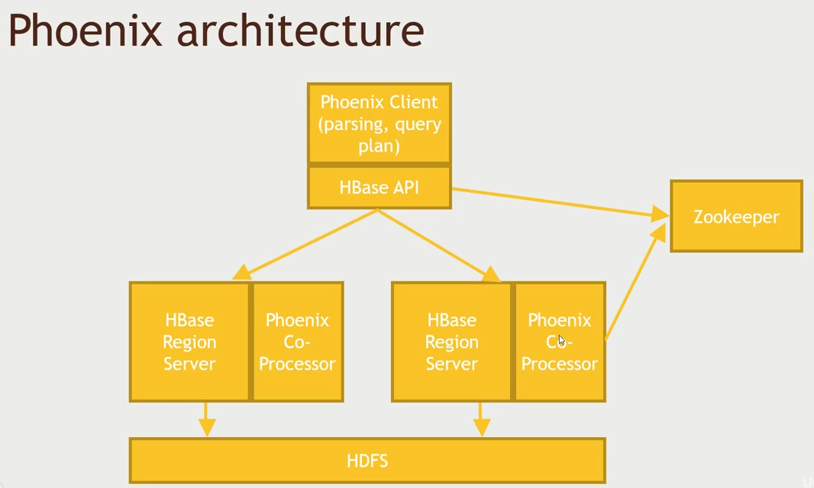

# Query Engine

Engines which lets you use SQL queries to query wide range of databases inside the Hadoop eco-system.

- `Apache Drill` - lets you use SQL query against SQL and NoSQL database. ex. Hive, HBase, MongoDB etc.. but it cannot talk to `Cassandra`.
- `presto` - same like drill but not an apache project but built by facebook. Now its an opensource. It can talk to `Cassandra` while It cannot talk to `MongoDB`.
- `Apache Phoenix` - sits on top of `HBase` but conceptually its a query engine that also lets you issue SQL queries across non relational database. **Only works with** `HBase`.
-The choosing between drill and presto boils down to whether we need to query `cassandra` or `mongodb`.

## Apache Drill

> Its not a part of HDP, so we need to install it manually.

- An SQL query engine for various NoSQL and datafiles
  - Hive, HBase, MongoDB
  - Even flatfiles like JSON or Parquet files on HDFS, S3, Azure, Google Cloud, local file system
- Based on Google's Dremel
- It's uses the real SQL description.
- It also exposes a driver `ODBC`/`JDBC` where we can connect to the other application like Tableau.
- When installing drill in HDP we need to install `1.12` that will work with Hive that comes with HDP.

### Example Drill

> Ensure that `127.0.0.1:8765/storage`, `hive` and `mongodb` are enabled. Update `hive.metastore.uris: thrift://localhost:9083`

- We will import data into Hive (movieratings) and MongoDB (moviedata)
- Setup Drill on top of both 
- Query them both

## Apache Phoenix

> If you're only working with Hbase then you can go with the right tool which focuses only that.

- Developed by Salesforce and then made outsource
- Supports transaction.
- This is good for OLTP too - Fast and Low latency
- It exposes a JDBC connector for HBase
- Integrates Spark, MapReduce, Spark, Hive, Pig and Flume
- Phoenix is much easier to issue SQL query execution than the native HBase client.



### Phoenix with HBase

- Install the [phoenix](./Section7-56%20InstallPhoenixAndQueryHBaseWithIt.txt)
- We will create a table in hbase using phoenix.
- We will load the data to [hbase using pig phoenix client PhoenixHBaseStorage](./phoenix.pig)

```sh
# So go back to phoenix cli interface
python sqlline.py
# to see all tables
0: jdbc:phoenix> !tables 
# We need to create the users table for execute the pig script
```

```sh
# tell where to find the phoenix jar files so it can connect to it
REGISTER /usr/hdp/current/phoenix-client/phoenix-client.jar
```

## Presto 

- It is similar to Drill
- A layeer between Databases and SQL queries
- Optimized for OLAP - not for OLTP like Phoenix like fast querying
- Exposes JDBC driver, command line and tabulea

### Presto Hands on

- Set up Presto
- Query our Hive ratings table using Presto
- Spin Cassandra back up, and query our users table in Cassandra with Presto
- Execute a query that joins users in Cassandra with ratings in Hive!
- Install [presto](./Section7-59%20InstallPresto,AndQueryHiveWithIt.txt)
- Then query both the [hive and cassandra](./Section7-60%20QueryBothCassandraAndHiveUsingPresto.txt)
