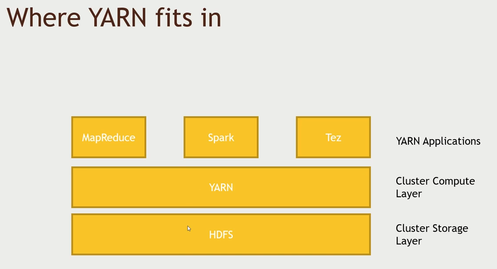
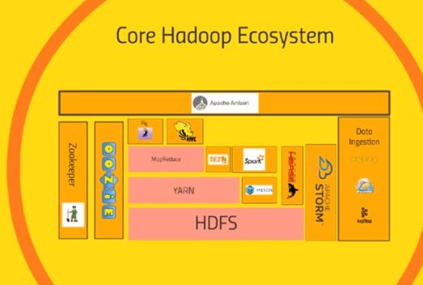
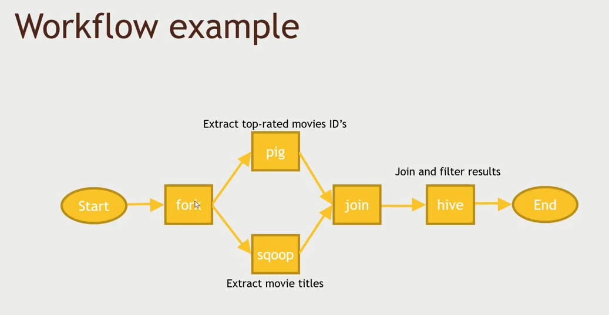
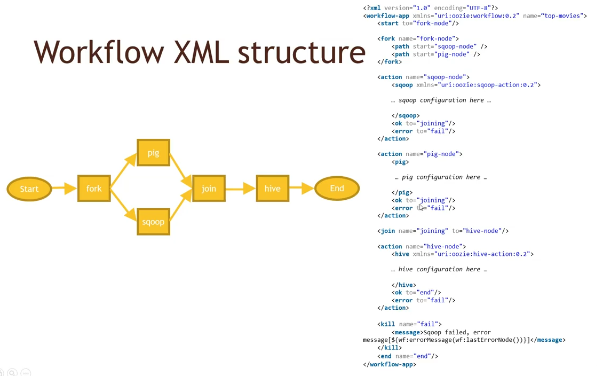
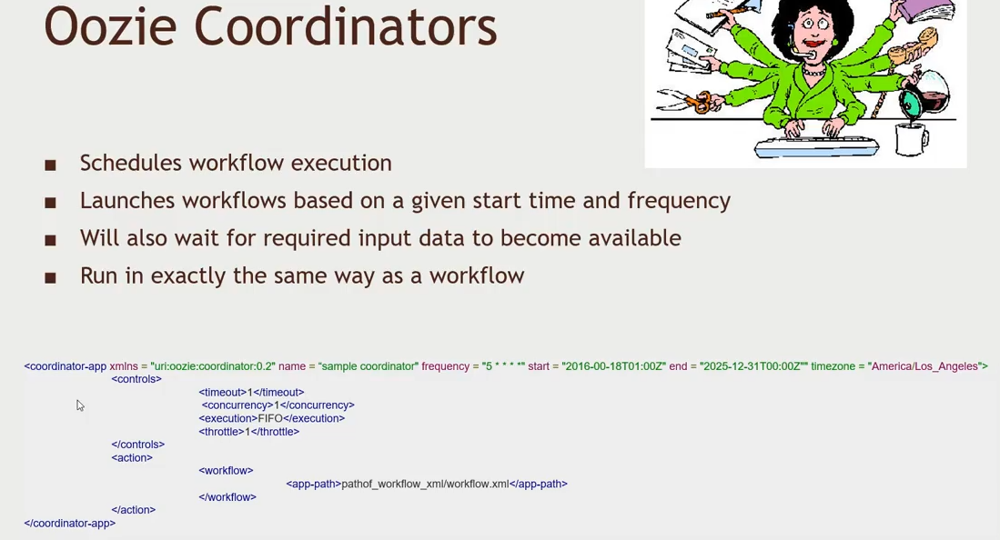

# Underneath the Hood




## Tez

- Tez replaces the MapReduce job and much faster
- Success is because of DAGs(Directed Acyclic Graphs) by which it optimizes the workflow.
- To select `Tez` in hive execution engine in UI,
  - Hive UI -> Settings icon -> Select `hive.execution.engine` in the dropdown -> `tez`
- To excute pig with tez we need add this in the command line

```sh
> pig -f <path> -x tez
# to run in mapreduce
> pig -f <path> -x mapreduce
# if using hive 
> pig -useHCatalog -x tez -f <path>
# or in the script
set exectype tez
```

## Mesos

- Mesos is similar to YARN - another Yet another Resource Negotiator
- Mesos was built by twitter.
- YARN is restricted to hadoop tasks while Mesos manages the whole data center
- Mesos is more general purpose than YARN - it can manage long live webserver to short lived processors.
- We dont need to choose between YARN or Mesos, we can integrate both with the use of a package called `Myriad`.
  - YARN might talk to Mesos to get its resources
- Spark and Storm is built to work on Mesos.
- There are alternatives to Mesos like Kubernetes and Docker for managing containers.
- To run Spark and Storm you dont need hadoop necesarily so you can install mesos and use them.

## Zookeeper

- It allows coordinating across the cluster while maintaining and electing the master.
- What tasks are assigned to which worker and which nodes are available.
- To resolve clock drift

## Oozie

> Oozie orchestrates your hadoop jobs

- A system for scheduling and running hadoop jobs
- A multi-stage hadoop jobs
  - Might chain together MapReduce, Hive, Pig, sqoop, and diskcp tasks
  - Other systems available via add-ons (like Spark)
- Creates a `fork` node where it will make multiple parallel nodes and this workflow will be written in the `xml`.
- Oozie doesnt have a UI of its own



- `to` property is used to where to go to next.



### Steps to setup a Oozie Workflow

- Make sure each action **works on its own**
- Make a directory in HDFS for your job
- Create your `workflow.xml` file and put it in your `HDFS` folder
- Create `job.properties` defining any variables and put it in your HDFS folder
  1) This goes on your local filesystem where you will launch the job from
  2) You could also set these properties within your xml

### Oozie Co-ordinator

> Used when you need to kick-off certain workflow at certain time-period.

- Schedule workflow execution
- Launches workflows based on a given start time and frequency
- Will also wait for required input data to become available
- Run in exactly the same way as a workflow



### Oozie Bundle

- Oozie bundle is new in Oozie 3.0 
- Bundle is a bunch of co-ordinators which can be managed together to start or stop.

### Simple Oozie Workflow

> Example workflow xml code is found [workflow.xml](./workflow.xml) and [job.properties](./job.properties). We can use oozie co-ordinator if we need to run it periodically.

- We will get movielens into MySQL if it's not still there
- Write a Hive script to find all movies released before 1940
- Set up an `Oozie` workflow that uses `sqoop` to **extract movie information from MySQL**, then **analyze** it with `Hive`
- `kill` node will end the job.
- We need to put the hive script, properties and workflow to the hdfs so oozie can see it. We need to install the mysql connector jar file manually since it doesnt come with the hdp sandbox.
- We need to restart all the oozie services from ambari ui

```sh
> oozie job --oozie http://localhost:11000/oozie -config /home/maria_dev/job.properties -run
# this will return us a job id
```

Now we can go to [http://localhost:11000/oozie](http://localhost:11000/oozie) to see the job id.

## Apache Zeppelin

> A notebook interface to big data. Its something similar ipython notebook. 

- Apache Zeppelin spans across many different technologies in hadoop stack.
- Zeppelin has a very tight integration with Apache Spark.
- Zeppelin can be plugged into other tools like Hive, Accumolo, kylin, etc.. which are called `interpreters`.
- If you need to import the already created notebook, import [Playing with MovieLens.json](./Playing%20with%20MovieLens.json)

## Hue

> `Hue` is sort of like `Ambari`.

- You wont get `hue` with the current distribution of hortonworks but you will see it with the cloudera distribution
- Hue - stands for Hadoop User Experience
- Hortonworks - uses `Ambari` for UI and hdfs file system and Zeppelin for notebooks style analysis while `cloudera` uses Hue for file, UI and notebook.
- Hue has a workflow editor where you can create the oozie workflow by drag and drop.
- Its open source but installing it in hortonworks is really a pain.
- In [gethue.com](https://gethue.com) we can check it out.

## Other tools

### Ganglia

> Ganglia is `dead`, last updated in `2008`

- Is an old monitoring tool developed by UC Berkeley
  - Wikipedia and Wikimedia used to use this.
- Now, its largely supplanted by Ambari, Cloudera manager and Grafana running on top of ambari (pretty dashboard).

### Chukwa

> Chukwa is `dead`, last updated `2010`

- System for collecting, aggregating and analyzing logs in Hadoop cluster
- used by Netflix intially
- Largely supplemented by Flume and Kafka
  - Both are more general purpose and not only for hadoop cluster
  - Faster 
  - Easier to setup
  - More reliable
