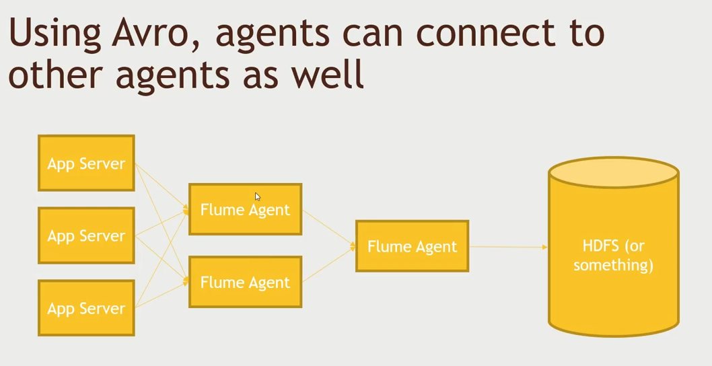

# Real-time Data Stream

- Sometimes you might need to process data as the data is coming in and not sitting there in the cluster.

## Kafka

- Kafka is a general-purpose publish/subscribe messaging system
- Kafka servers store all incoming messages from publishers fro some period of time, and publishes them to a stream of data called a topic
- Kafka consumers subscribe to one or more topics, and receive data as it's published
- A stream / topic can have many different consumers, all with their own position in the steam maintained
- It's not just for Hadoop
- Kafka uses zookeeper for maintaining which topics and available and who subscribe to it.

### Example Kafka

> The implementation details is available [here](./Section9-76PublishingWebLogsWithKafka.txt). `source` > `connector` > `sink`

- We will write all the logs from different servers and aggregate it to a single file using kafka as new logs comes in under the same topic.
- This is similar to publishing web logs.
- The [access_log_small.txt](./access_log_small.txt) file will be the example log files.

## Flume

- In hadoop world, there is more than one way to solve the same problem.
- Flume was originally made to get data into the Hadoop into the ecosystem unlike kafka which is more general purpose.
- One of the most popular usecase for using Flume is for log aggregation.
- Flume agents are `source`, `channel` and `sink`.
- It can use many things as source like console application, kafka, avro, thrift, etc...
- with `netcat` we can connect to a port and add data to it

- simple flow the [example.conf](./example.conf)
- We will use telnet in this example look for implementation details in [flume and publish logs](./Section9-Section9-78SetUpFlumeAndPublishLogsWithIt.txt)

- live log flow the [flumelogs.conf](./flumelogs.conf) and we will have a new subdirectory generated for every 10 minutes
- Its parsed using the timestamp header
- Look for implementation details in [monitor flume log flow and into directory](./Section9-79SetUpFlumeToMonitorADirectoryADirectoryAndStoreItsDataInHDFStxt)

