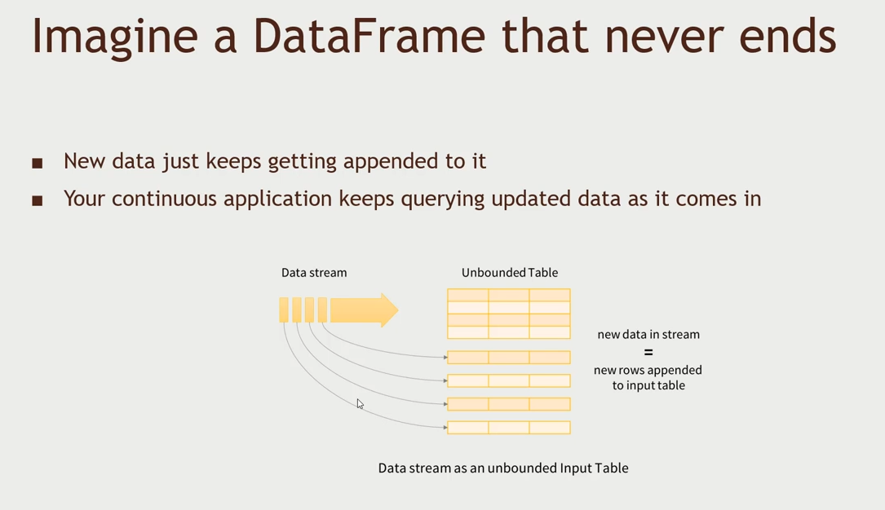

# Streaming

> Spark Streaming and Apache Storm

- We've seen in the [previous](./section-09/README.md) section on how to get the real time data into HDFS
- Now, in this section we need to know how to process that incoming data.
- Rather than analyzing it in batch manner for incoming streams of data, why can't we analyze them as they are coming in?

## Spark Streaming

> Whenever we're doing a windowed operation we need to maintain the state somewhere `a directory`, so that if something fails then we can restart the job and continue from where we left off.

- Spark streaming is not really real-time what it does is called `micro-batches` ex. like for `1sec` batches.
- `Dstream` is responsible for generating RDDs at batch intervals.
- Spark streaming job is different from batch processing in spark job is that we process using the `Dstream`.
- Windowed Transformation allows for analyzing microbatches greater than your single micro-batch limit.
- ex: top-sellers from the past hour
  - You might process data every one second (the batch interval)
  - But maintain a window of one hour
- Window `slides` as time goes on to represent batches within the window interval


### Batch interval vs. slide interval vs window interval

- The `batch` interval is **how often data is captured into a** `Dstream`
- The `slide` interval is **how often a windowed transformation is computed**.
- The `window` interval is **how far back in time the windowed transformation goes**.


### How does it look in code

```py
# Windowed transformations: code
# The batch interval is set up with your SparkContext: batch interval of 1
ssc = StreamingContext(sc, 1)

# You can use reduceByWindow() or reduceByKeyAndWindow() to aggregate data across a longer period of time!
# how to combine two dstream rdd, how you remove two rdds, window interval: 300s -> 5 min, slide interval: every second compute it
hashtagCounts = hashtagKeyValues.reduceByKeyAndWindow(lambda x, y: x + y, lambda x, y : x - y, 300, 1)
```

### Structured Streaming

- We're moving to a new paradigm called the `strcutured streaming`, available in spark 2.0 and 2.1
- Its idea is to use DataFrames instead of using `individual RDDs` and `Dstreams`



#### Advantages of Structured Streaming

- Streaming code looks a lot like the equivalent non-streaming code (batch processing with DataFrames)
- Structured data allows Spark to represent data more efficiently
- SQL-style queries allow for query optimization opportunities - and even better performance
- Interopability with other Spark components based on DataSets
  - MLL is also moving towards DataSets as its primary API.
- DataSets in general is the direction Spark is moving

#### Example: S3 bucket with Structured Streaming

Lets say we need to monitor an `s3` bucket for new log data and group up how many times a certain action is received in a one hour window and write the result to a database.


- We only need a two lines of scala code to do this,

```scala
val inputDF = spark.readStream.json("s3://logs")
inputDF.groupBy($"action", window($"time", "1 hour")).count().withStream.format("jdbc").start("jdbc:mysql//...")
```

### Flume with Spark Streaming

> The [access log](./access_log.txt) we will use and see the number of unique logs

We will be using flume to stream data and instead of writing it to hdfs, we will analyzing it on the fly using spark streaming.


- The flume file is available [here](./sparkstreamingflume.conf). Avro is just a communication protocol.
- The spark streaming to connect with [flume](./SparkFlume.py)
- We need three terminal instances one for `flume`, `spark streaming` and `for copying the log file to spool dir`

```sh
mkdir checkpoint
export SPARK_MAJOR_VERSION=2

# To run Spark with the packages and libraries
spark-submit --packages org.apache.spark:spark-streaming-flume_2.11:2.2.0 SparkFlume.py

# From Ambari admin menu you an select "Stack and Version" to see Flume or any installed service version to change that for 
# 2.11 refers to the scala version for spark, and 2.2.0 is for python version
```

## Apache Storm

- Another framework to process continuous streams of data that are coming into the cluster
- Can run ontop of YARN
- Works on `individual events`, not `micro-batches (RDDs)` like spark streaming
- If you need `sub-second` latency, then `storm` is for you. It doesn't need to work on batch intervals and breakdown RDDs and can process as quickly as the event is received.

### Storm Terminology

- `Spout` can get data from anywhere like flume, spark, kafka, etc..


### Count words with Apache Storm

## Apache Flink
