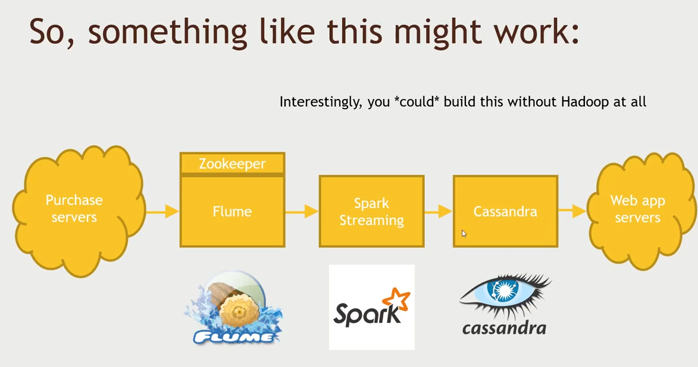
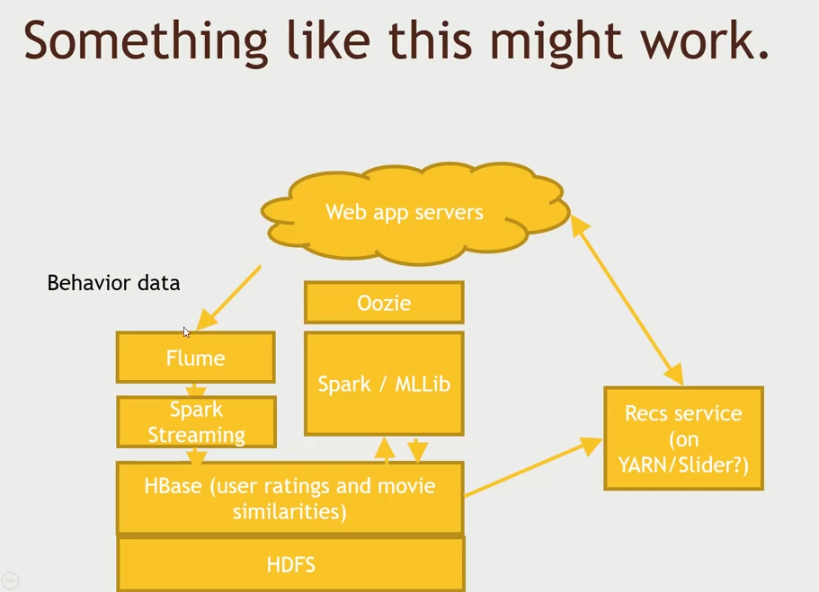
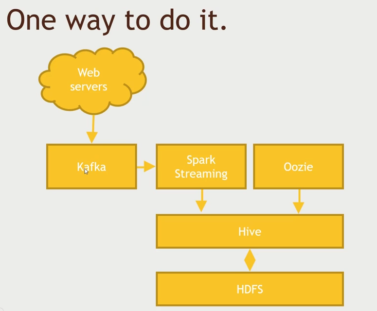

# Other technologies

## Impala

- Cloudera alternative to `Hive`
- Massive Parallel SQL engine on Hadoop
- Impala is always running, so you avoid the start-up costs when starting a Hive query
  - Impala is made for `BI-style` queries
- Bottom line: Impala's often faster than Hive, but Hive offers more versatility
- Consider using Impala instead of Hive if you are using Cloudera

## Accumulo

> Like HBase with better security. a NoSQL database.

- Another BigTable clone (like `HBase`)
- But offers a better security model
  - `Cell-based access control` - Tightly control who can see what data
- And server-side programming
- Consider it for your NoSQL needs if you have complex security requirements
- But make sure the systems that need to read this data can talk to it.

## Redis

> `memcache` can only store key-value pair while Redis can store whole range of data structures.

- A distributed in-memory data store (like `memcache`)
- But it's more than a cache
- Good support for storing data structures
- Can persist data to disk
- Can be used as a data store and not just a cache
- Popular caching layer for web apps

## Ignite

> This is an alternative to `redis`.

- An `in-memory data fabric`
- Think of it as an alternative to Redis
- But it's closer to a database
  - `ACID` guarantees - ex. for financial transaction
  - SQL support
  - But it's all done in-memory

## Elasticsearch

- A distributed document search and analytics engine
- Really popular
- Wikipedia, The Guardian, Stack Overflow, many more
- Can handle things like real-time search-as-you-type
- When paired with `Kibana`, great for interactive exploration
- Amazon offers an Elasticsearch Service

## Kinesis (and the AWS ecosystem)

- Amazon Kinesis is basically the AWS version of `Kafka`
- Amazon has a whole ecosystem of its own
  - Elastic MapReduce (EMR)
  - S3 - can be used instead of `HDFS`
  - Elasticsearch Service / CloudSearch
  - DynamoDB - like `Cassandra`
  - Amazon RDS - `RDBMS`
  - ElastiCache
  - AI / Machine Learning services
  - EMR in particular is an easy way to spin up a Hadoop cluster on demand

## Apache NiFi

> Allows you to construct data processing flow.

- Directed graphs of data routing
  - Can connect to `Kafka`, `HDFS`, `Hive`
- Web UI for designing complex systems
- Often seen in the context of IoT sensors, and managing their data
- Relevant in that it can be a streaming data source you will see

## Falcon

> If you've multiple data processing flow, if you need to manage the complexity then you would have a Flacon on top of the workjob scheduler (Oozie).

- A `data governance engine` that sits on top of Oozie
- Included in Hortonworks
- Like NiFi, it allows construction of data processing graphs
- Buts it's really meant to organize the flow of your data within Hadoop

## Apache Slider

- Deployment tool for apps on a `YARN` cluster
- Allows monitoring of your apps
- **Allows growing or shrinking your deployment as it's running throughout the cluster**
- Manages mixed configurations
- Start / stop applications on your cluster
- Incubating

## Architecture

### Exercise 1: Consume Weblogs and Keep track of top-selling books

### Exercise 2: Consume Weblogs and recommend movies using item-based filtering

#### Working backward

- Users want to discover movies they haven't yet seen that they might enjoy
- Their own behavior (ratings, purchases, views) are probably the best predictors
- `Availability` and `partition-tolerance` are important. `Consistency` not so much. Refer `CAP` theorem and choose the database of choice.

### Exercise 3: Keeping Tracks of Sessions

